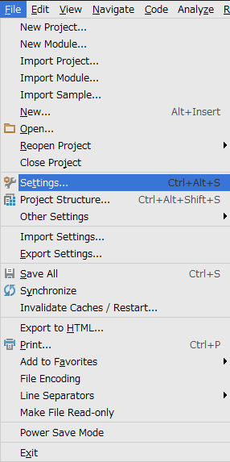
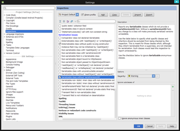
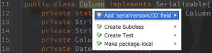

Android StudioでSerializable実装クラスを実装した時にserialVersionUIDの警告がでなかったのでそのメモ。

<!--more-->

メニューのFile->Settingsを開きます。

左のメニューからInspectionsを選択し、Serializable class without 'serialVersionUID'の項目にチェックをし、OKを押します。

エディタのSerializableを実装したクラス名の上にカーソルを合わせてAlt+Enterを押すと"Add 'serialVersionUID' field"という項目があるのでEnterを押すと自動的にクラスに追加されます。

